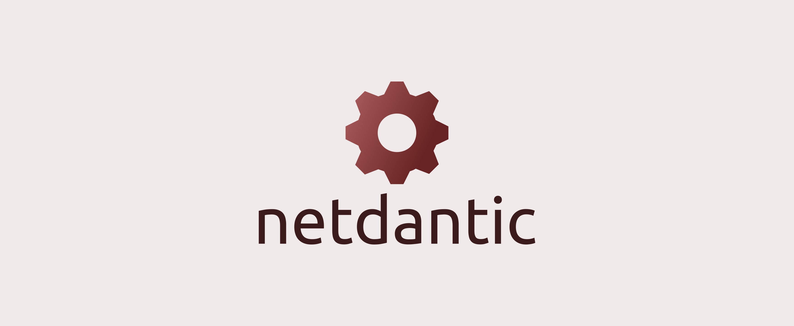

# netdantic

I love networking. I also love using [Pydantic](https://docs.pydantic.dev/latest/) with Python. Combine the two and you get netdantic..

netdantic isn't a tool to solve all your interop vendor problems, trying to shove vendor specific yang models down your throat while you hold onto that little bit of faith that maybe one day, they'll introduce openconfig or openconfig will add a specific feature for a yang model. It isn't a tool which pushes configuration and validates the state, or rolls back on error using netconf operations, its simply hand-crafted pydantic models to improve the developer experience and consistently provide python models that try to align to the openconfig standards (or near enough). That doesn't exclude vendor specific models however during the first few iterations of this project, I will focus heavily on handcrafting pydantic models that closely follow openconfig yang models.

"But x module/application can convert yang models for me into fully usable python classes?". Yeah but have you actually tried using them outside a lab and in production? Try and compile a certain vendor and tell me you don't run into some kind of conversion error or just poor developer experience with something like VSCode intellisense/autocomplete. After a few interations, I may look into automatically converting YANG models into Pydantic models but for now I would prefer to craft them manually for the common protocols I see deployed. If you see a specific feature/protocol which isn't modelled then feel free to contribute and make it easier for other people to adapt and use these models to build their own services/config generators/etc...

A short but friendly rant: There are many great tools out there which attempt to solve the vendor interop issues, trying to consolidate a common model like the interfaces output of different vendors and potentially different protocols/methods to gather the data in the first place (eg. Netconf vs Restconf vs CLI scraping vs SNMP vs Telemetry etc...) but everyone seems to define their own models/create the models in their own view without trying to adopt the one thing that was made to solve this issue. Vendors attempt to utilize OpenConfig but they are either too lazy and don't like the idea of customers being able to deploy services on their kit without using their own controller or they don't want to extend the models which is literally built into YANG itself (augment) and then end up creating their own models because its the easier route. Maybe one day netdantic will be augmented to support parsers which take vendor specific yang models and consolidate them into a openconfig like model but for now this is not the goal, the goal is not to control how you configure your network device (eg. CLI vs NETCONF vs SNMP vs RESTCONF) but how you should be utilizing models in your scripts and systems that interact with different vendor devices. Your CLI configuration templates may have different syntax, or your XML tree may have different tags based on the vendor specific yang model, but the actual data you're using in these templates should be exposed to which ever template engine you are using (with nice editor support like VSCode intellisense/autocomplete) :-) plus its annoying when people force you to install a load of dependencies and make you compile things when you can simply `pip install blah`

Useful RFCs:
- [The YANG 1.1 Data Modeling Language - RFC7950](https://datatracker.ietf.org/doc/html/rfc7950)
- [Network Management Datastore Architecture (NMDA) - RFC8342](https://www.rfc-editor.org/rfc/rfc8342)
- [YANG Library - RFC8525](https://www.rfc-editor.org/rfc/rfc8525)
